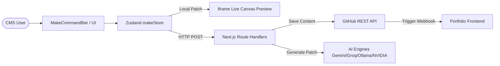

# Architecture Guide

The Portfolio Manager acts as a Headless Content Management System (CMS) and AI Generation Studio, built on Next.js 16 (App Router).

## System Design

This CMS operates without a traditional SQL or NoSQL database. Instead, it relies on an external GitHub repository acting as the content data layer. Decoupling the administration panel from the static frontend provides:
1. Complete static-site generation (SSG) for the portfolio frontend, ensuring maximum page speed and security.
2. Zero database infrastructure maintenance or hosting costs.
3. Native version control and audit history for all content updates via Git commits.

## Component & State Architecture

- **Framework**: Next.js 16 (App Router) + TypeScript.
- **UI Components**: Tailwind CSS, Shadcn UI primitives, custom `FigmaCard` & `FigmaInput` components.
- **Global State Management**: `useMakeStore` (`src/store/makeStore.ts`) powered by Zustand with `persist` middleware.
  - Manages `siteDocument` (the full content tree), `ghostDiff` (uncommitted AI patches), `generationState`, `chatOpen`, and `versions`.

## Data Integration & Persistence Pipeline

All content mutations follow a safe 2-step write pipeline:

### 1. Transient Live Preview
- When an AI prompt is processed by `/api/make`, the API returns a structured JSON patch.
- The CMS stores the original content in `ghostDiff.before` and the patch in `ghostDiff.after`.
- `siteDocument` is updated in local Zustand memory ONLY, triggering an iframe reload. The user sees the visual change on the canvas in real time.

### 2. GitHub REST Commit (`src/lib/github.ts`)
When the user clicks `[✓ Accept]` (or saves a manual form edit):
1. The client sends a `POST` request to the target endpoint (e.g., `/api/projects`).
2. The route handler validates the payload and calls `saveContentJSON`.
3. `saveContentJSON` fetches the current SHA of the file in GitHub, base64-encodes the JSON, and issues a `PUT` request to commit the change to `GITHUB_BRANCH`.
4. GitHub Actions builds and deploys the updated portfolio static site.

### Reversion Mechanism
If the user clicks `[Discard]`:
- The store restores `siteDocument` to `ghostDiff.before` and clears `ghostDiff`.
- No HTTP request is sent to GitHub, ensuring no unwanted commits or build triggers occur.

