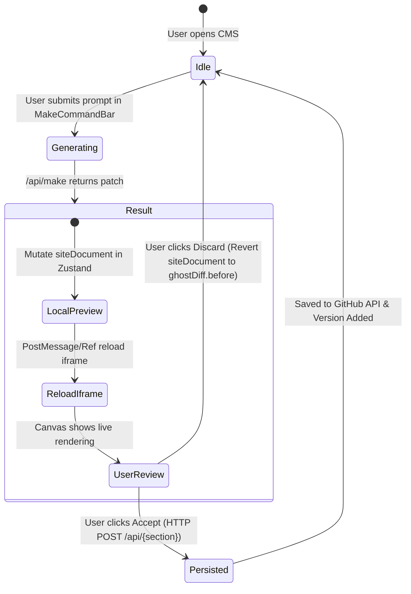

# Figma AI Workflow & UX Specification

This document details the Figma AI (Figma Make) design system, state machinery, component layout, and backend pipeline implemented in the Portfolio Manager CMS.

---

## 1. Design Philosophy & Inspiration

Figma AI (Figma Make) establishes a calm, unintrusive workspace experience. The CMS incorporates these key UX tenets:

1. **Floating Command Pill (`MakeCommandBar`)**:
   - Anchored at the bottom center of the canvas viewport.
   - Low visual noise: single send button, image attachment input, and an inline contextual chip (`Editing {section}`).
   - Avoids aggressive modal dialogs, backdrops, or full-screen canvas dimming during generation.

2. **Right-Docked Chat (`DockedChatPanel`)**:
   - Replaces floating pop-over dialogs with a persistent, collapsible right-side dock.
   - Keeps the main preview canvas completely visible while chatting with the AI.
   - Provides expandable reasoning trails (`● Reading projects data...`) showing step-by-step progress.

3. **Sticky Action Footer**:
   - The `[✓ Accept]` and `[Discard]` actions are permanently pinned to the bottom of the chat dock.
   - Ensures action buttons are never hidden behind scrollbars or buried beneath long chat threads.

---

## 2. Live Canvas Preview & State Machine

The AI editing workflow strictly separates **transient visual previewing** from **backend persistence**.



### State Machine Rules
1. **`ghostDiff` Holding**:
   - When `/api/make` completes, `setGhostDiff({ before: originalData, after: patchData })` is invoked.
2. **Local Memory Mutation**:
   - `siteDocument[targetSection]` is updated immediately in local Zustand memory.
   - The preview iframe (`http://localhost:4321`) re-renders instantly, allowing the user to see the proposed design changes live.
3. **Commit Phase (`handleAccept`)**:
   - Issues an `HTTP POST` request to `/api/{targetSection}` containing the new patch data.
   - Calls `addVersion("AI Update applied", siteDocument)` to append to version history.
   - Clears `ghostDiff` and resets `generationState` to `"idle"`.
4. **Revert Phase (`handleDiscard`)**:
   - Restores `siteDocument[targetSection]` back to `ghostDiff.before`.
   - Re-triggers the iframe reload so the visual preview reverts instantly.
   - Clears `ghostDiff` and resets `generationState` to `"idle"`. **No network write is performed.**

---

## 3. Version History & Key Safety

Version history is managed in `useMakeStore` via `versions: Version[]`.

### Key Uniqueness Constraint
To prevent React list rendering duplicate key errors (`Encountered two children with the same key`):
```typescript
addVersion: (label, data) => set((state) => {
  const maxId = state.versions.length > 0 ? Math.max(...state.versions.map(v => v.id)) : 0;
  const newId = maxId + 1;
  return {
    versions: [...state.versions, { id: newId, timestamp: Date.now(), label, data: JSON.parse(JSON.stringify(data)) }],
    currentVersionId: newId,
    siteDocument: JSON.parse(JSON.stringify(data))
  };
})
```
Calculating `newId` from `Math.max(...versions)` guarantees strict key uniqueness even after reverting to older version IDs.

---

## 4. Frontend Dynamic Binding Standard

To prevent frontend crashes when content is edited or renamed via AI:
- **Dynamic Slicing**: `HomePage.tsx` dynamically slices `finalProjects.slice(0, 4)`.
- **Anti-Pattern Warning**: Never rely on static arrays of slug strings (e.g., `const FEATURED_SLUGS = ["aquadot", "smartflow-iv"]`). If a user renames a slug to `smartflow-div` in the CMS, static lookups will fail or hide entire sections. Dynamic slicing ensures the portfolio frontend always renders safely.
